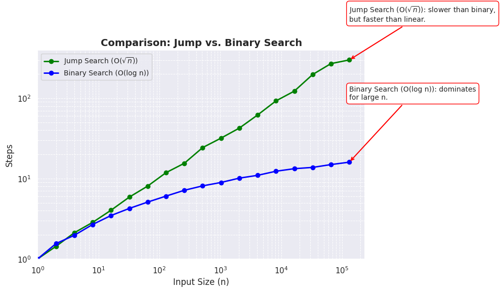
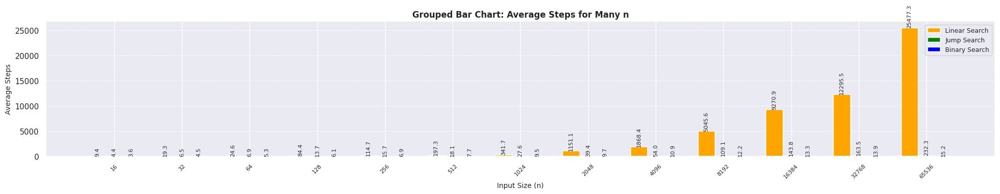
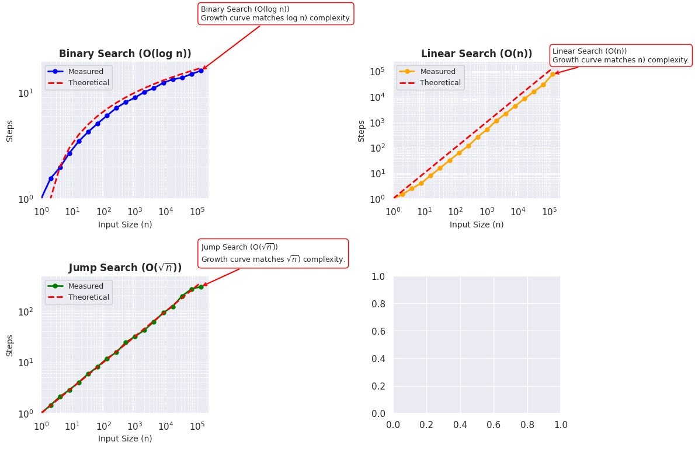

## Explanation of Search Algorithms and Performance Analysis

## Introduction
This document provides an in-depth explanation of three fundamental search algorithms: Linear Search, Jump Search, and Binary Search. We analyze their performance based on complexity and empirical observations, including visual representations of their behavior.

## Search Algorithms Overview

### 1. Linear Search (O(n))
**Description:**
- A simple search algorithm that checks each element in the list sequentially.
- Best used for small datasets or unsorted arrays.
- Time complexity: **O(n)**.
- Space complexity: **O(1)**.

```python
def linear_search(arr, target):
    steps = 0
    for i in range(len(arr)):
        steps += 1
        if arr[i] == target:
            return i, steps
    return -1, steps
```

### 2. Jump Search (O(√n))
**Description:**
- Optimized for sorted arrays, dividing the array into fixed-size blocks and skipping ahead.
- Performs fewer comparisons than linear search.
- Time complexity: **O(√n)**.
- Space complexity: **O(1)**.

```python
def jump_search(arr, target):
    steps = 0
    n = len(arr)
    jump = int(math.sqrt(n))
    prev = 0
    while prev < n and arr[min(jump, n) - 1] < target:
        steps += 1
        prev = jump
        jump += int(math.sqrt(n))
        if prev >= n:
            return -1, steps
    for i in range(prev, min(jump, n)):
        steps += 1
        if arr[i] == target:
            return i, steps
    return -1, steps
```

### 3. Binary Search (O(log n))
**Description:**
- Efficient search for sorted datasets using a divide-and-conquer approach.
- Cuts the search space in half with each iteration.
- Time complexity: **O(log n)**.
- Space complexity: **O(1)** for iterative, **O(log n)** for recursive.

```python
def binary_search(arr, target):
    head = 0
    tail = len(arr) - 1
    steps = 0
    while head <= tail:
        steps += 1
        mid = (head + tail) // 2
        if arr[mid] == target:
            return mid, steps
        elif arr[mid] < target:
            head = mid + 1
        else:
            tail = mid - 1
    return -1, steps
```

## Performance Analysis and Visualization

### 1. Comparison of All Search Algorithms


**Observations:**
- **Linear Search:** Step count grows linearly.
- **Jump Search:** Shows moderate growth, outperforming Linear Search for larger datasets.
- **Binary Search:** Exhibits the fastest growth curve, adhering to O(log n).

### 2. Jump Search vs. Binary Search



**Observations:**
- Jump Search performs better than Linear but falls behind Binary for larger values of `n`.
- Binary Search dominates for larger input sizes.

### 3. Grouped Bar Chart: Average Steps for Different Input Sizes



**Observations:**
- Binary Search consistently requires fewer steps compared to the other methods.
- As `n` increases, the advantage of Binary Search becomes more pronounced.

### 4. Individual Growth Trends



**Observations:**
- The measured results closely follow the theoretical complexity predictions.
- Binary Search matches logarithmic growth, Linear Search aligns with linear complexity, and Jump Search fits a square root pattern.

## Scalability Considerations
- **Linear Search:**
  - Scales poorly with large datasets.
  - Best suited for small, unsorted collections.

- **Jump Search:**
  - Provides a good balance for sorted datasets.
  - Better scalability than linear, but not as efficient as binary search.

- **Binary Search:**
  - Excellent scalability for sorted datasets.
  - Handles large data sizes efficiently with minimal step increases.

## Conclusion
The analysis confirms the expected theoretical complexities:
- **Linear Search:** Suitable for small datasets or unsorted arrays.
- **Jump Search:** A good middle ground for sorted arrays when Binary Search isn't feasible.
- **Binary Search:** The best option for large, sorted datasets due to its logarithmic complexity.

Choosing the right search algorithm depends on the dataset characteristics and performance requirements.
